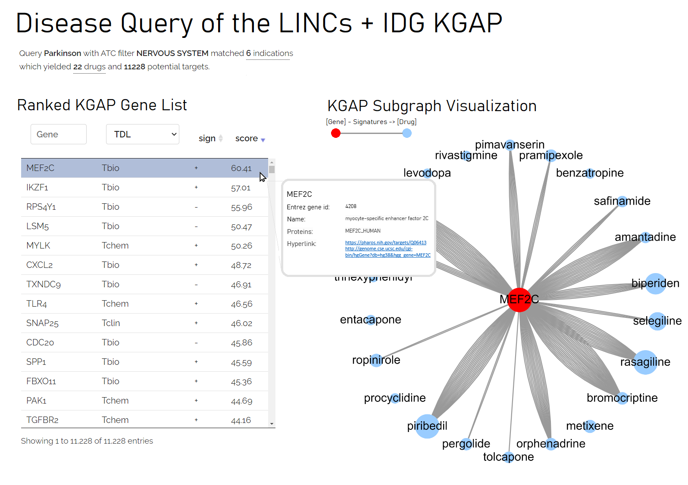

# KGAP:LIDIA

LIDIA: LINCS+IDG Drug-target Illumination Application

## Dependencies

Requires Neo4j KG via:

* [KGAP:LINCS-IDG Repo](https://github.com/IUIDSL/kgap_lincs-idg)

## See also:

* [KGAP Home Page](https://cheminfov.informatics.indiana.edu/projects/kgap/)

## Execution

### Configuration

* Edit `neo4j.json` with valid parameters, normally
<http://localhost:5000> for Neo4j Server, or with Neo4j Desktop, examine log for correct port. Specify valid authentication credentials or disable authentication via Settings (`dbms.security.auth_enabled=false`).
* Edit `drugcentral.json` with valid PostgreSQL parameters.

### Running the web application

With database loaded and running, in Neo4j Server, or Neo4j Desktop, Flask web
app service may be launched locally with `Go_Local.sh`.
